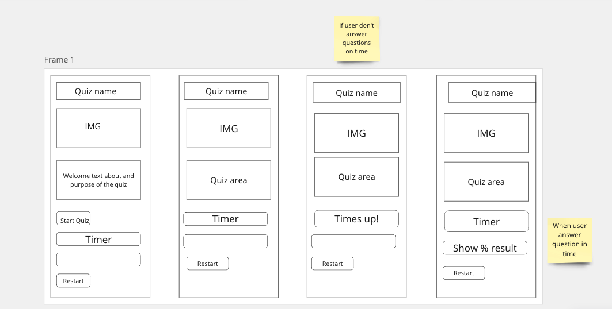
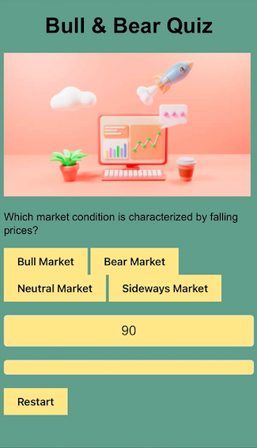
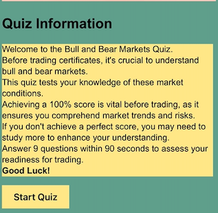
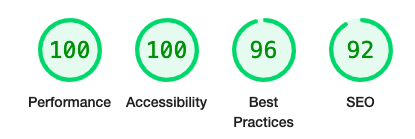

#Bull & Bear Quiz

Welcome to the Bull and Bear Quiz! This quiz is designed to test your understanding of the basics of the financial market, particularly focusing on bull and bear markets.

[Find the live website here!](https://rosencrantzart.github.io/annaquiz/)

- [Purpose](#purpose)
- [What to Expect](#whattoexpect)
- [Scoring](#scoring)
- [How to Use](#howtouse)
- [Disclaimer](#disclaimer)
- [Wirefram](#wirefram)
- [Wirefram](#wirefram)
- [Usergoals](#usergoals)
- [Testing](#testing)
- [Bugs](#bugs)
- [Design](#design)
- [Quiz pages](#quizpages)
- [ProjectImprovements](#projectimprovements)
- [Learnings](#learnings)
- [Contributing](#contributing)

## Purpose
Before diving into trading securities, it's crucial to have a solid grasp of market dynamics. This quiz serves as a preliminary test to evaluate your readiness and comprehension of market trends and risks.

## What to expect
The Bull and Bear Quiz consists of a series of questions related to bull and bear markets. It's important to note that this quiz is not designed to provide the correct answers. Instead, it aims to gauge your understanding of market concepts.

## Scoring
To be considered adequately prepared for trading, you must achieve a perfect score of 100%. Anything less indicates areas where further study may be necessary.

## How to use
Simply follow the instructions provided in the quiz interface. Answer each question to the best of your ability, aiming for a flawless performance.

## Disclaimer
This quiz is intended for educational purposes only and should not be considered as financial advice. Always conduct thorough research and seek professional guidance before making investment decisions.

Enjoy the challenge and best of luck in your journey to understanding the intricacies of the financial market!

## Wirefram 

## Usergoals 

The primary goal of this Bull and Bear Market quiz is to assess your foundational understanding of market conditions, helping you determine if you're ready to start investing. By answering questions about typical investor behaviors and market characteristics, you'll gain insights into how to react during different market phases. This quiz only tests your basic and schould not be consider a qualified test. 

### Programs & Libraries

- [Balsamiq](https://balsamiq.com/) - The wireframes used for the site was created with Balsamiq.

- [Chrome DevTools](https://developer.chrome.com/docs/devtools/) - A powerful tool used throughout the creation of the website.

- [Coolors](https://coolors.co/) - The colour palette was generated with the help of Coolors.

- [Git](https://git-scm.com/) - Git was used through the Gitpod terminal to commit to Git and push to GitHub.

- [GitHub](https://github.com/) - All code for the site is stored on GitHub after being pushed from Git. GitHub Pages serves as host for the site.

- [JSHint](https://jshint.com/) - Validation of JavaScript code was done with JSHint.

- [Unsplash](https://unsplash.com/) - The background image for the site was provided by Unsplash.
   

- [W3C](https://www.w3.org/) - Validation of HTML and CSS code was done with W3C.

## Design

- #### Colours
  The colour scheme chosen for the website was generated with [Coolors](https://coolors.co/)   

Colorful Contrast for Engaging Finance Quizzes

In crafting our financial quiz, I aimed to stand out by blending playfulness with educational depth. Our color choices were strategic, reflecting our desire to engage a younger, particularly female, audience with a vibrant and welcoming vibe.

I opted for #ffe38d, a warm gold, to symbolize optimism and growth, making finance feel less intimidating and more inviting. Paired with #6f9b8b, a serene green, it creates a balanced, dynamic, and harmonious palette that's both visually appealing and emotionally uplifting.

Additionally, I chose #1f2f3e for the text color to ensure readability without the harshness of pure black. This subtle shade provides a comfortable reading experience, enhancing the overall accessibility and engagement of the quiz.

This playful color scheme was chosen to challenge traditional, serious approaches to finance, offering a fresh, engaging alternative that makes learning about money enjoyable and accessible. It's my way of saying that finance can be exciting and fun, encouraging exploration and empowerment among our users.

Through our colorful design, we aim to inspire curiosity, foster understanding, and ultimately, empower individuals to take charge of their financial future with confidence and enthusiasm.

This addition highlights the thoughtful consideration behind the text color choice, emphasizing readability and comfort alongside the visual appeal and educational goals of the quiz.

Font -Franklin Gothic Medium 

## Quiz pages

This is the first page that the user meets to understand the meaning

Information about the quiz and purpose and also about the risk that trading with certificats are

## Deployment & Local Development

### Deployment

The site is deployed using GitHub Pages - [Bull&BearQuiz](https://github.com/RosencrantzArt/annaquiz/)
To Deploy the site using GitHub Pages:

1. Login (or signup) to Github.
2. Go to the repository for this project, [RosencrantzArt/annaquiz](https://github.com/RosencrantzArt/annaquiz).
3. Click the settings button.
4. Select pages in the left hand navigation menu.
5. From the source dropdown select main branch and press save.
6. The site has now been deployed, please note that this process may take a few minutes before the site goes live.

### Local Development

#### How to Fork

To fork the repository:

1. Log in (or sign up) to Github.
2. Go to the repository for this project, [RosencrantzArt/annaquiz](https://github.com/RosencrantzArt/annaquiz)
3. Click the Fork button in the top right corner.

#### How to Clone

To clone the repository:

1. Log in (or sign up) to GitHub.
2. Go to the repository for this project, [RosencrantzArt/annaquiz](https://github.com/kera-cudmore/TheQuizArms)
3. Click on the code button, select whether you would like to clone with HTTPS, SSH or GitHub CLI and copy the link shown.
4. Open the terminal in your code editor and change the current working directory to the location you want to use for the cloned directory.
5. Type 'git clone' into the terminal and then paste the link you copied in step 3. Press enter.

## Testing 

Pearpear-code review. 
Family and friends
Lighthouse

- [HTML5](assets/images/validationhtml.png)

- [CSS3](https://en.wikipedia.org/wiki/CSS)

- [JavaScript](https://www.javascript.com/)

## Bugs

Throughout my recent project, I encountered several small bugs that required attention to ensure the smooth operation of our application. Each bug presented a unique challenge, but together, they contributed to a more refined and user-friendly experience. One of the most significant bugs involved the behavior of the answer buttons after the allotted time had expired and once the results were finalized. Initially, users were able to continue clicking on the answer buttons even after the quiz had ended, which could lead to confusion and unintended consequences.

Recognizing the importance of addressing this issue, I reached out to my mentor for guidance. With their expertise and support, we worked collaboratively to devise a solution. The final bug fix involved implementing a mechanism that disabled the answer buttons once the quiz concluded, preventing further interaction and ensuring that the results accurately reflected the user's last action

## Unfixed bugs 

I could't make all the content on page centred to make It look good on desktop. I tried flex-box, max-width and It did'd work. When no time left and also that the target group I'm 
aiming for this quiz, mobile first is most essential. 

## Project Improvements

-Overview

-This project aims to enhance the user experience and visual appeal through various improvements. These changes include optimizing content for desktop viewing, personalizing messages based on user scores, achieving symmetry in design, and imbuing a finance-oriented aesthetic.

- Proposed Improvements

- Desktop Optimization
Centred Content: Ensure all content is centrally aligned to enhance readability and aesthetics on desktop screens.
Responsive Design: Implement responsive design principles to adapt the layout seamlessly across different screen sizes.

- Personalized Messages
User Score-based Messages: Tailor messages based on the user's performance or interaction with the application. Provide encouraging feedback or helpful tips depending on their scores.
 

## Learnings
Developing the Bull & Bear Quiz taught me valuable lessons about project management and coding practices. Initially, I rushed into coding without adequate planning, leading to unnecessary revisions and delays. This experience emphasized the importance of thorough project planning to avoid scope creep.

I also recognized the significance of commenting and documenting my code early in the development process. This oversight made debugging and maintenance more difficult than expected. Going forward, I'll integrate commenting as a standard part of my coding routine to improve code readability and maintainability.

JavaScript posed particular challenges in understanding logic, despite using a mix of LMS resources and YouTube tutorials in my native language. This highlighted the need for a deeper understanding of JavaScript fundamentals and that I need more time for practice. 

Overall, this project has been a catalyst for improving my project management skills, coding practices, and JavaScript proficiency, equipping me better for future projects.

## Contributing

